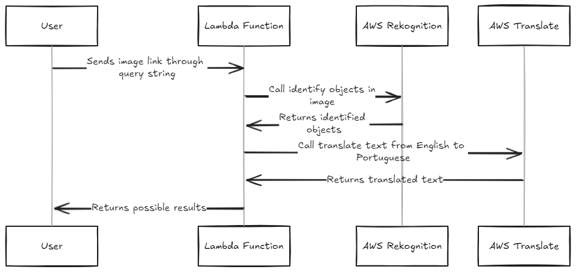

# AWS Rekognition and Translate Lambda Function with Serverless Framework

This project demonstrates how to use AWS Rekognition and AWS Translate services within an AWS Lambda function, deployed using the Serverless Framework. The function analyzes an image from a provided URL, detects labels with high confidence, translates the labels into Portuguese, and formats the results.

## Prerequisites

- AWS account with necessary permissions for Rekognition and Translate services.
- Node.js and npm installed.
- Serverless Framework installed globally (`npm install -g serverless`).

## Installation

1. Clone the repository:

   ```sh
   git clone https://github.com/augustodevjs/image-analysis-aws
   cd image-analysis-aws
   ```

2. Install dependencies:

   ```sh
   npm install
   ```

3. Configure AWS credentials:
   Ensure your AWS credentials are set up. You can use the AWS CLI to configure them:
   ```sh
   aws configure
   ```

## Deployment

Deploy the function using the Serverless Framework:

```sh
serverless deploy
```

## Application Flow

The image above represents the flow of the application, created using Excalidraw. It illustrates the process from receiving the image URL to returning the translated labels to the user.


